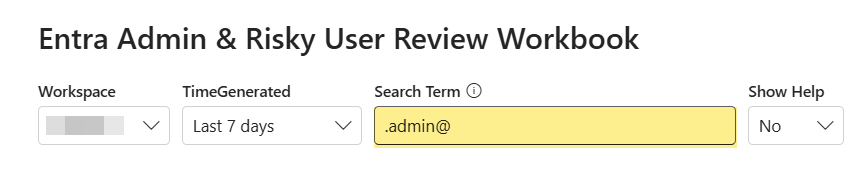
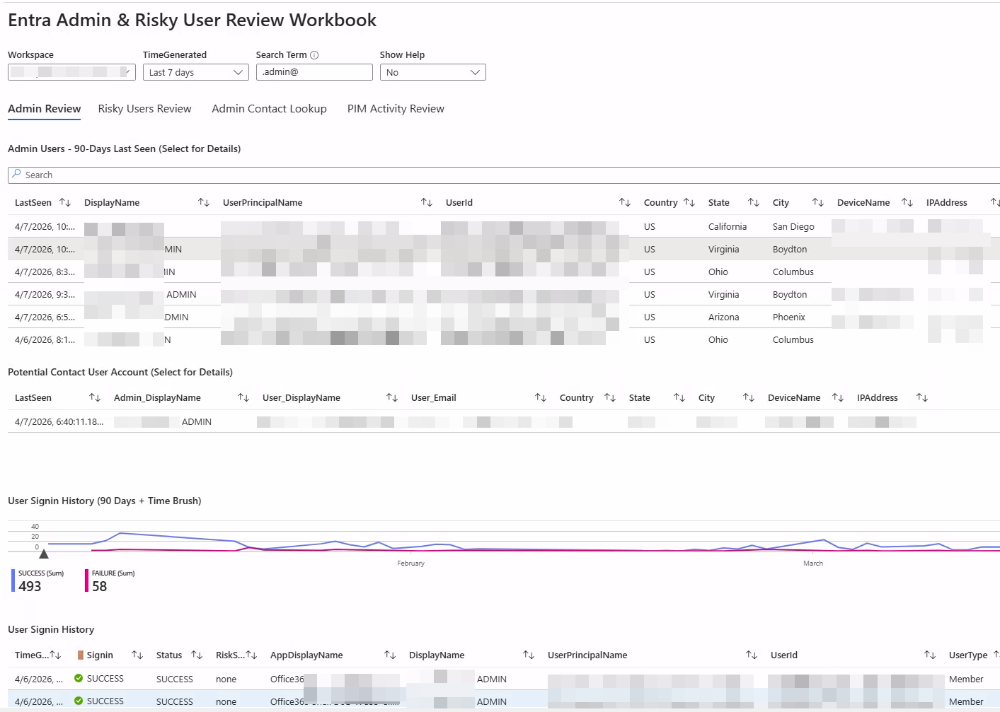
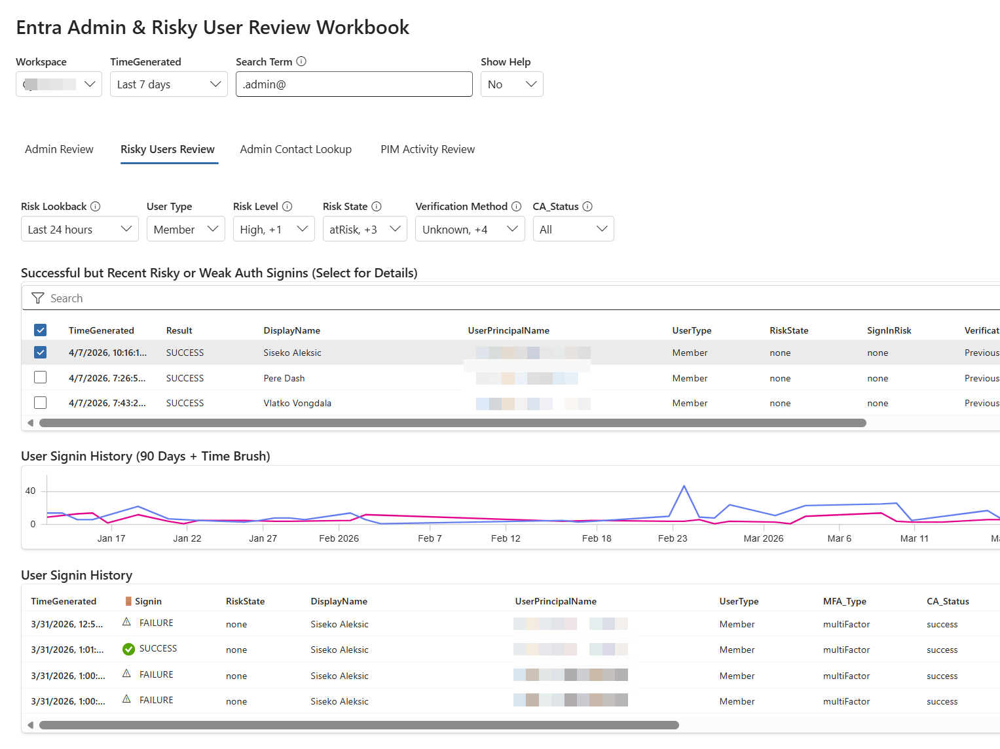
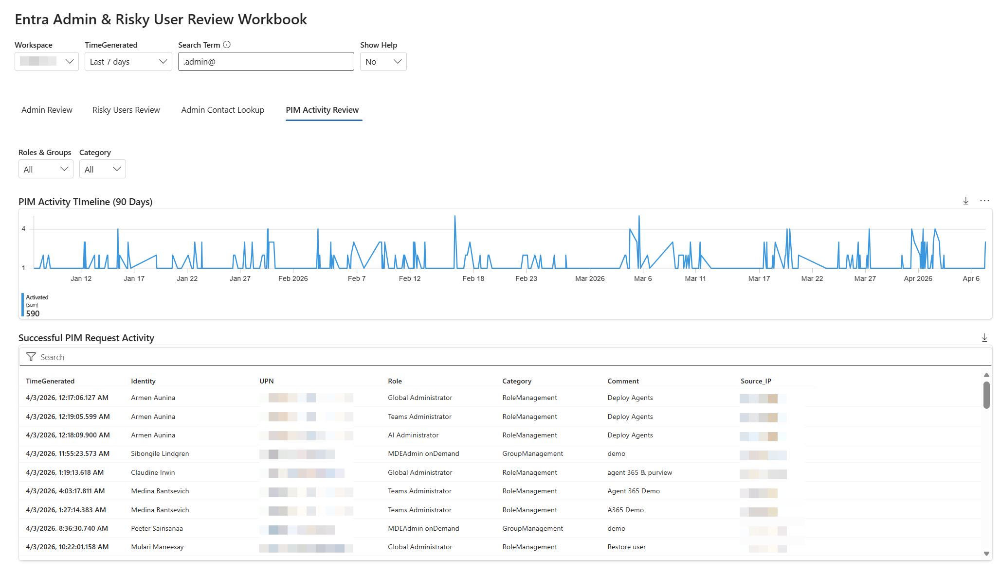
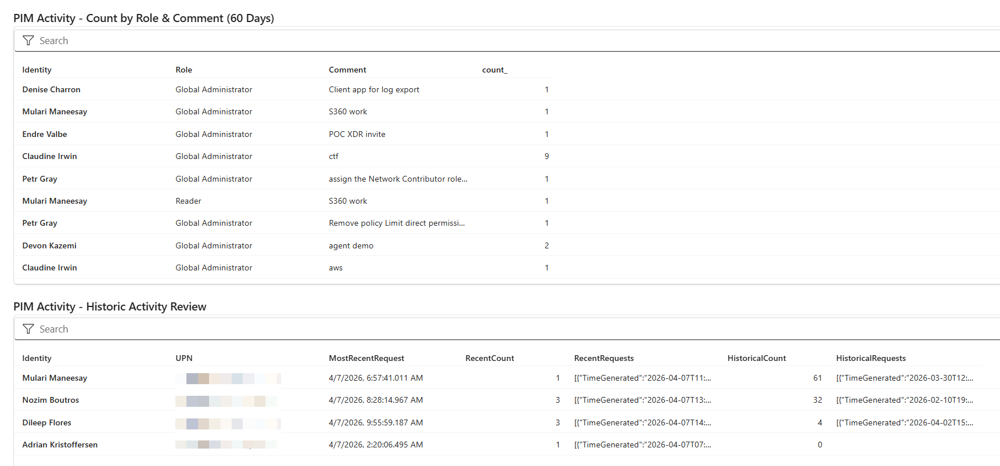

# Entra Admin and Risky User Review Workbook

This workbook is a major revision focused on practical analyst workflows for investigating administrative and risky users in Microsoft Entra ID. It correlates Entra sign-ins, Sentinel incidents and alerts, UEBA, MDE device context, PIM activation history, and Azure administrative activity in one place.

## Why This Workbook Matters

Many organizations separate daily-use identities from privileged admin identities. That is good security practice, but it creates an investigation gap:

- Admin accounts are often detached from obvious owner/contact context.
- Admin accounts frequently have limited profile metadata.
- Analysts need fast pivots from admin identity to behavior, incidents, devices, and PIM usage.

This workbook is built to close that gap quickly and consistently.

## Critical Dependency: Search Term Pattern

The **Search Term** parameter is the key dependency for this workbook.

- Default value: `.admin@`
- Purpose: identify likely admin identities in UPN patterns
- Example alternatives: `adm`, `-admin`, `_admin`, or a dedicated admin domain marker

If your environment does not have a clear and consistent admin naming pattern, matching and correlation quality drops significantly.

Use this view to validate and tune the Search Term first:

## Major Revision Coverage

### 1. Main Admin Review Experience

The main view lists likely admin accounts and enables deeper investigation pivots, including sign-in activity, related incidents and alerts, device context, PIM history, and Azure activity.

### 2. Risky User Review (Details)

The risky-user path applies the same investigation flow to users flagged by identity risk signals. This is useful for quickly determining whether risky accounts also show privileged or suspicious operational behavior.

### 3. PIM Activity Review

The PIM section provides broad role activation visibility and trend analysis, including role/category filters and activation patterns.

### 4. PIM Activity Details

The detail view highlights activation-level evidence, including role, category, source IP, and justification comments for deeper governance and compliance review.

## Data Sources Required

For full functionality, your workspace should include:

- `SigninLogs`
- `AuditLogs`
- `IdentityInfo` (if available from MDI/M365 Defender integration)
- `BehaviorAnalytics`
- `SecurityIncident`
- `SecurityAlert`
- `DeviceLogonEvents`
- `DeviceInfo`
- `AzureActivity`

If one or more sources are missing, sections can appear empty.

## Import

1. Open Microsoft Sentinel or Azure Monitor.
2. Go to **Workbooks**.
3. Create a new workbook and open **Advanced Editor**.
4. Switch to **JSON** mode.
5. Paste contents of `AzureAdminReviewWorkbook.json`.
6. Save the workbook.

## Analyst Notes

- Start by tuning **Search Term** until admin candidate detection matches your naming standard.
- Validate correlated user matches before operational action.
- Use PIM comment and source IP context to identify weak or unusual activation behavior.
- Empty widgets usually indicate missing data source coverage, not necessarily workbook errors.

## Files

- `AzureAdminReviewWorkbook.json`
- `images/searchTerm.png`
- `images/mainView.png`
- `images/detailsView.png`
- `images/pimReview.png`
- `images/pimDetails.png`

## License

Provided as-is. Validate queries and assumptions in your environment before production use.
